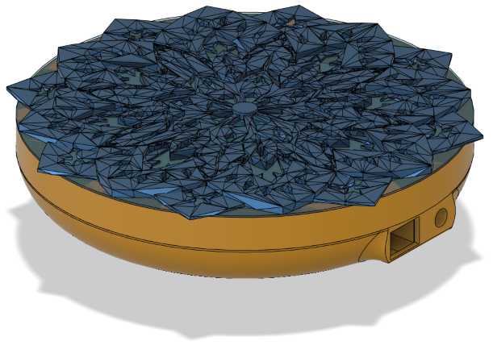

# Mandala Infinity Mirror

This is an art project for Freezerburn 2023: Weird Science.

The entire top half of the object will rotate, creating a kaleidoscopic effect.

## Design

Used an existing model for a [mandala](https://www.thingiverse.com/thing:4248155E) and created the rest of object in Fusion360.

* [D1 Mini](https://www.amazon.com/dp/B08C7FYM5T?psc=1&ref=ppx_yo2ov_dt_b_product_details)
* [LiPo battery, 3.7v 1200mAh](https://www.adafruit.com/product/258)
* [Battery Charger](https://www.adafruit.com/product/259)
* [Slip ring](https://www.amazon.com/dp/B07H2SRMXP?psc=1&ref=ppx_yo2ov_dt_b_product_details)
* [WS2811 LEDs, 60/m](https://www.amazon.com/dp/B01CNL6LBK?psc=1&ref=ppx_yo2ov_dt_b_product_details)

## Pics

